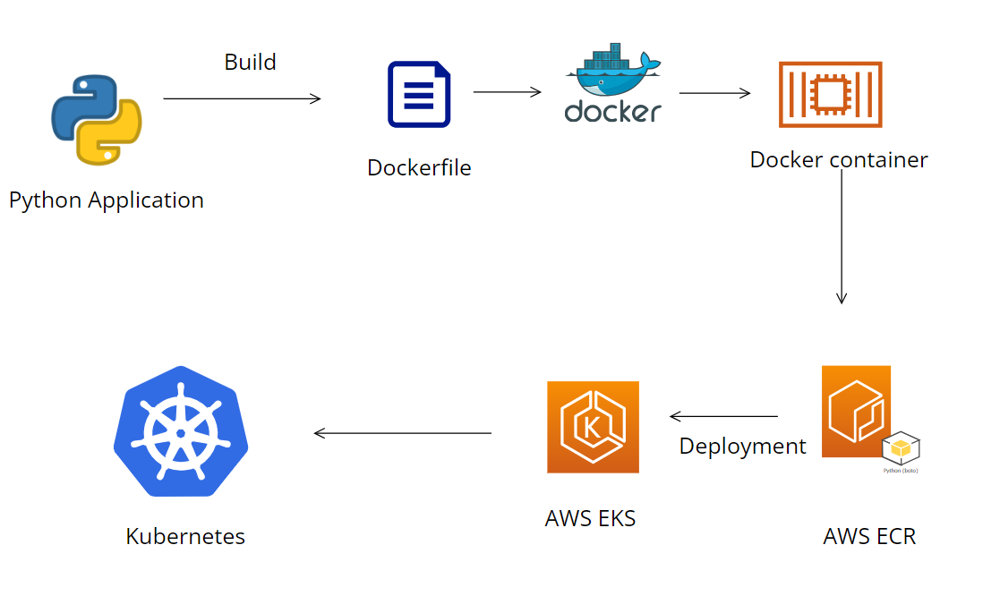
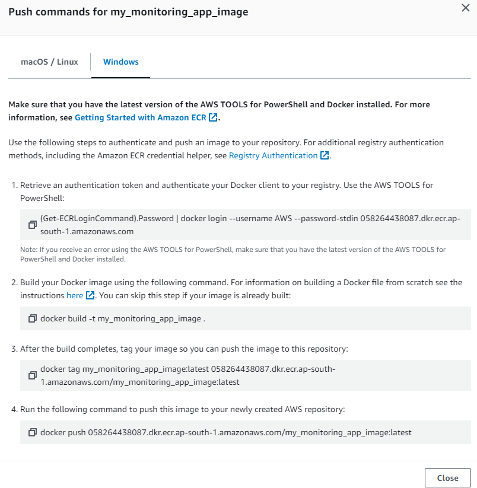
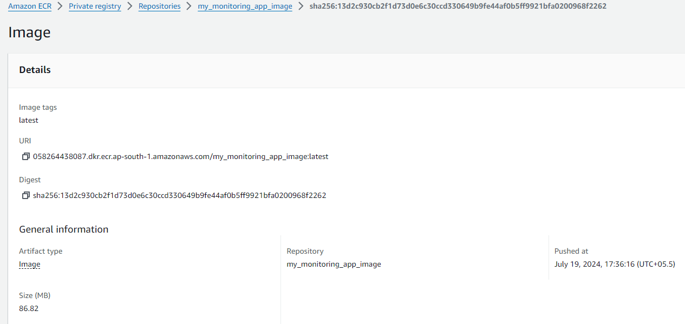
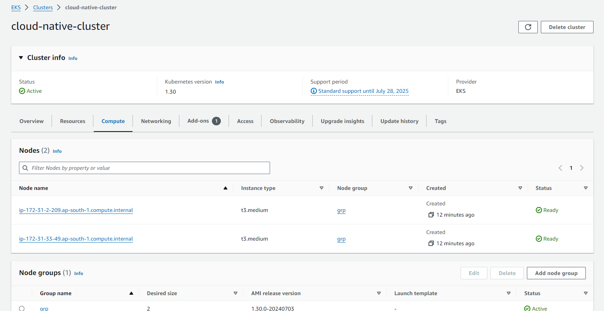
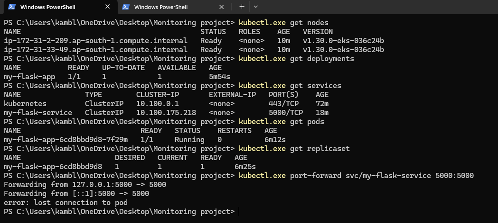
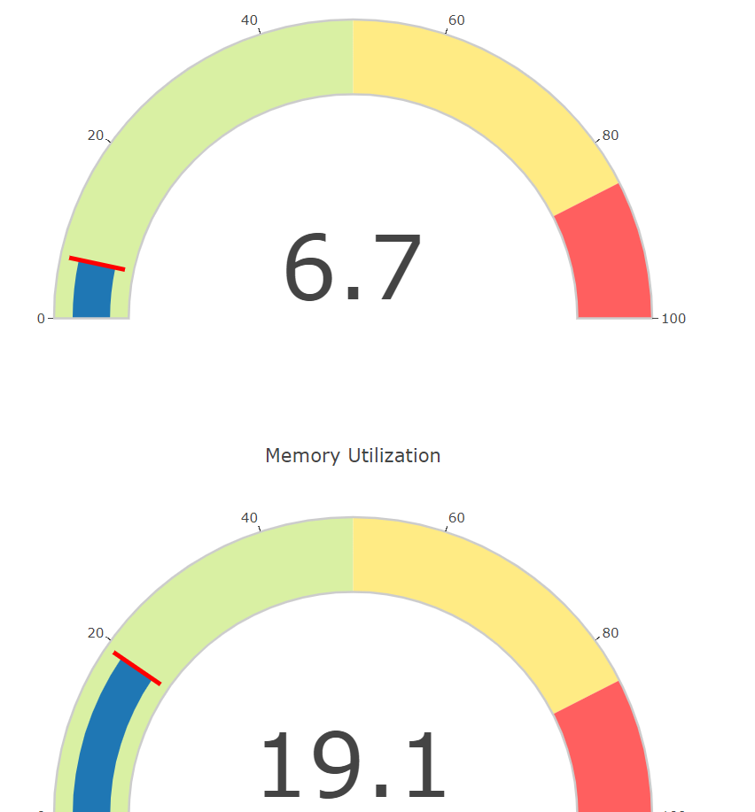

# Cloud-native monitoring app on Docker and Kubernetes

## Introduction:


The Cloud Native Resource Monitoring Python Application on Kubernetes is built to provide real-time tracking of CPU and memory usage within a Kubernetes cluster. By leveraging Flask for developing the web application and psutil for collecting system metrics, this tool offers a dynamic dashboard accessible via a web browser. Users can observe live CPU and memory usage data, with notifications triggered if utilization exceeds 80%, indicating possible resource bottlenecks. When deployed on Kubernetes, the application takes advantage of Kubernetes' orchestration capabilities, ensuring scalability and robustness, thereby facilitating the effective management of containerized workloads in a cloud-native environment.

## Aim:

* To create a python monitoring web app and host it on Kubernetes cluster.


## Things to do:

1. Create a Monitoring application in python usig Flask and psutils.
2. Create a Dockerfile, Docker image and run a Docker container.
3. Create Amazon ECR repository using Python Boto3 sdk and push docker image to ECR.
4. Create Kubernetes multinode cluster.
5. Create Kubernetes Deployments and Services using Python.

## Prerequisites:

* AWS account.
* AWS CLI configured powershell terminal.
* Python3, Boto3, psutils and Flask installed.
* Docker and Kubectl installed.

## Architecture



# Steps:

### 1. Deploying monitoring app locally.

* Install dependencies:  
The following command will install all the required dependencies automatically listed in the requirements.txt file


    ```bash
    pip3 install -r requirements.txt
    ```

* Create app.py and index.html accordingly as shown in this repository.  

    Run the following command to start the Flask server on localhost:5000. Navigate to http://localhost:5000/ on your browser to access the application.

    ```bash
    python3 app.py
    ```
---------------------------
### 2. Dockerizing the application

* Create a Docker file accordingly as shown in this repository.

#### Note: name your file as 'Dockerfile' only(case-sensitive).

* Run the following command to build an image.
    ```bash
    docker build -t <image_name> .
    ```

* You can run and test your docker image by running a container in docker itself.Run the following to start the Flask server in a Docker container on localhost:5000. Navigate to http://localhost:5000/ on your browser to access the application.  
    ```bash
    docker run -p 5000:5000 <image_name>
    ```

-----------------------


### 3. Pushing docker image to Amazon ECR.
### Note: Run the following command and feed in your access keys to use boto3 sdk   
```bash
aws configure
```

* Create and run an ecr.py file as shown in this repository to create an ECR repository in your AWS account.

* In AWS ECR you get steps for successfully pushing your docker image in their repository.


* Or you can aslo run the following command.
    ```bash
    docker push <ecr_repo_uri>:<tag>

    ```
    
------------------------

## 4. Creating EKS cluster and deploying the app using python

*  Create an EKS cluster and add a node group with 2 instances and instance type as t3.medium

    #### Note: Lower instance types caused issues in pod allocation.

    

*  Create and run an eks.py file as shown in this repository to create an EKS deployment and service in your AWS account.
    #### Note: make sure to edit the name of the image on line 26 with your image Uri.


* Check your K8s resources by running the following commands

    ```bash
    kubectl get deployment -n default 
    kubectl get service -n default 
    kubectl get pods -n default 

    ```
* Once your pod is up and running, run the port-forward to expose the service.
    ```bash
    kubectl port-forward service/<service_name> 5000:5000
    ```






------------------
## Congratulations you have successfully created a Monitoring app  deployed in a Kubernetes cluster!!